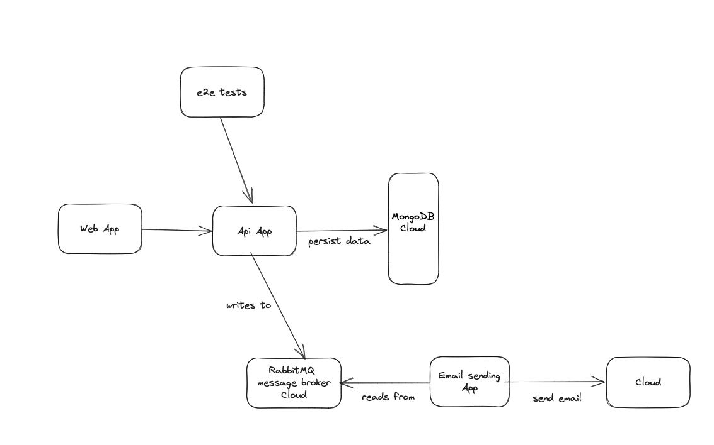

# Cypress Api E2E Testing Project

Welcome to the Cypress Api E2E Testing project! This repository contains end-to-end tests using Cypress and JavaScript for a local api application. The ecosystem's topology comprises local applications: a web application on port 3000, an API on port 3333, and an email sender. In the cloud, there are MongoDB for the database and RabbitMQ for messaging.

The system operates as follows: Users can register, log in, and, when logged in, create, view, edit, and delete tasks.

The web application communicates with the API and stores data in the MongoDB in the cloud. When a new task is created, the API sends a message to RabbitMQ in the cloud. The email application listens to the RabbitMQ queue and sends emails to the user.




The applications used in the tests were developed by Fernando Papito [linkedin](https://www.linkedin.com/in/papitoio/)

## Prerequisites

To run Api e2e tests using cypress, you only need to have the API app and MongoDB configured. However, if you'd like to see the entire ecosystem in action, feel free to explore further.

Before running the tests, ensure you have the following software installed on your system:

- [Node.js](https://nodejs.org/) version 18.10.0 or later
- [Npm](https://www.npmjs.com/package/npm/) (for dependency management)

## Getting Started

1. Clone this repository and navigate to the project folder:

    ```sh
    git clone <repository_url>
    cd cypress-api-sample
    ```

2. Create an account in mongodb cloud, create a cluster and get the credentials and put in the .env in:

    ```
    e2e-tests/.env
    apps/api/.env
    ```

3. Create an account in cloudamqp cloud, create a virtual host and get the credentials and put in the .env in :

    ```
    apps/mail/.env
    apps/api/.env
    ```

4. Create an account in ethereal.email cloud, and put the account configurations in the /apps/mail/app.js between lines 7 and 11 or use another SMTP of your choice, such as gmail:

    ```
    apps/mail/.env
    apps/api/.env
    ```

5. Start the target application locally:

    a. API:

    ```sh
    cd apps/api
    npm install
    npm run dev
    ```

    b. Web:

    ```sh
    cd apps/web
    npm install
    npm run dev
    ```
    c. Mail:

    ```sh
    cd apps/mail
    npm install
    npm run dev
    ```

6. Run the end-to-end tests:

    ```sh
    cd e2e-tests
    npx cypress run
    ```

   This command will execute the Cypress tests against the running api application.

## Structure

The project has the following structure:

- `apps/api`: API application for managing tasks
- `apps/web`: Web application for task management
- `apps/mail`: Mail application for send email
- `e2e-tests`: Contains Cypress test scripts

## Contributing

Contributions are welcome! If you find any issues or improvements, please submit a pull request or create an issue.

## License

This project is licensed under the [MIT License](LICENSE).

